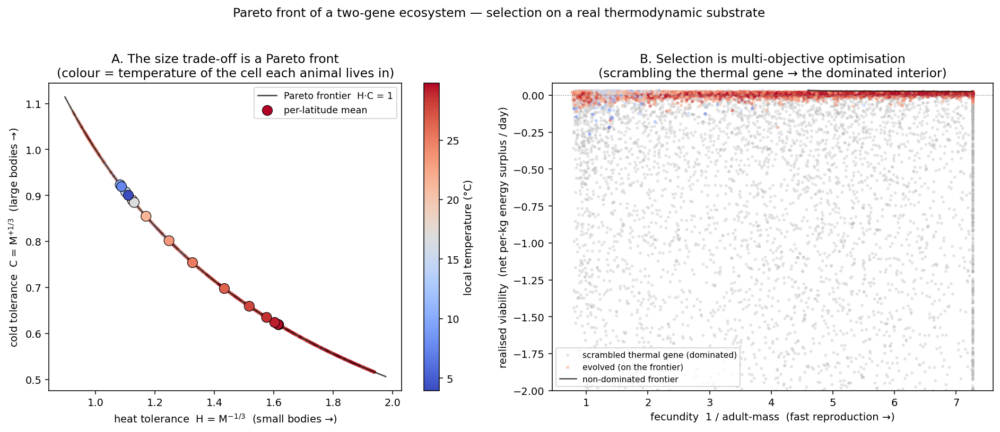
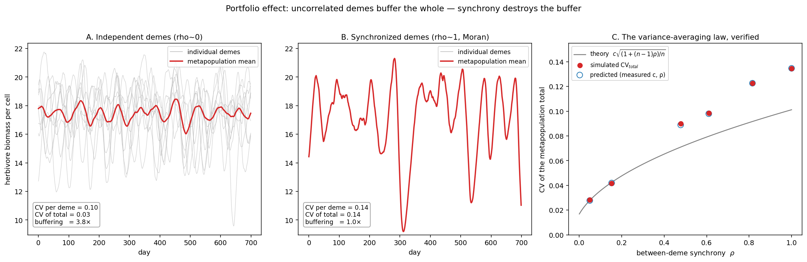

# Noether

**A conserved-substrate colony sim — "RimWorld, next level", built bottom-up from the laws of conservation.**

The thesis: lay down an honest substrate first — mass and energy that never appear or vanish — and let everything grow on top of it: ecology → evolution → **information** → mind → (next) politics. Named after Noether's theorem: conservation ↔ symmetry. Every emergent phenomenon higher in the tower is only trusted because the layer beneath it forges nothing.

Three promises hold at **every** layer:

1. **Conservation** — mass / energy-across-boundary / body-in-soil / monotone entropy (as appropriate to the layer).
2. **Determinism** — two runs are byte-identical ⇒ the whole history is reproducible and replayable.
3. **Depth = richness-of-consequences per unit representation** — nothing is modelled that has no demonstrable consequence.

## The tower

Ten modules, bottom to top. Each is **self-verifying**: its demo ends in `assert`s on the invariants it owns and prints a success marker. `Code/verify_all.py` runs the whole family twice (conservation + byte-determinism).

| # | module | guarantees | key numbers | sec |
|---|--------|------------|-------------|-----|
| 1 | `sim_core` | mass ==, energy == (thermal+chemical) | mass drift 0, energy 2.98e-8 J | 0.1 |
| 2 | `sim_ecology` | boundary flux + entropy (E−E0 == in−out, S↑) | energy err 2.67e-5 J, exported 113 MJ/K | 0.2 |
| 3 | `sim_genetics` | information accrues on a closed matter loop | bits = log2(σ0/σ); matter 9.3e-10 | 0.4 |
| 4 | `sim_world` | full synthesis on one patch (4 invariants) | mass 4.7e-10, energy 0.79 J, body/parcel 0, S 259672 MJ/K | 2.8 |
| 5 | `sim_space` | space: clines, range shift, refugium | E_rel ~1e-14; cline corr → 0.99 | 10.2 |
| 6 | `sim_traits` | two genes: temp_opt + size (Bergmann) | final sCorr −0.669 | 23.4 |
| 7 | `sim_pareto` | explicit Pareto front + domination | mean(H·C)=1.0000±6.7e-17; Bergmann −0.914; 94% scrambled dominated | 18.5 |
| 8 | `sim_portfolio` | portfolio effect (variance-averaging) | indep buffer 3.8×, sync 1.0×; sqrt-law gap ≤2.2% | 1.3 |
| 9 | `sim_eventlog` | universal event log (faithful, queryable) | matter 0.0; log replays the sim exactly; 18945 events | 2.9 |
| 10 | `sim_stage2` | a mind inside a pawn (typed, conserved, replayable) | matter ~1e-12; replay bit-identical; ON/OFF: mismatch 2.21→0.86 K, pop 31→102 | 2.3 |

See [`docs/module-tower.md`](docs/module-tower.md) for how the layers stack.

## Headline result — the cognition layer

`sim_stage2` seats a *mind* inside a pawn without giving it any power it should not have. The mind only **proposes** a typed action; the substrate **disposes** (validates against a legal menu, executes on the conserved grid). Every decision is logged as a `cognition` event and the world replays **bit-for-bit** from that log alone — so reproducibility survives even a nondeterministic LLM. Running the same world with cognition **ON vs OFF** (same seed): the focal lineage grows 31 → 102, biomass 10.6 → 41.4 kg, mean thermal mismatch halves 2.21 → 0.86 K, matter drift ~1e-12 kg. The mind is a *measurable delta*. Design: [`docs/cognition-9-principles.md`](docs/cognition-9-principles.md).

## Figures





## Quickstart

```bash
pip install -r requirements.txt          # numpy, matplotlib

python3 Code/verify_all.py               # run all 10 modules twice: conservation + determinism
python3 Code/sim_stage2.py               # cognition layer: ON/OFF, conservation, replay, a pawn's "theory of the world"
```

Each module also runs standalone, e.g. `python3 Code/sim_pareto.py`. The figure/log modules write their artifact next to themselves (`Code/`), and those regenerated files are git-ignored.

## Repository layout

```
Code/        the 10-module tower + verify_all.py
docs/        design notes (module tower, the 9 cognition principles, reversibility,
             conservation invariants, LLM tiers, Theoria Elitis threads, artifacts)
figures/     committed documentation figures (regenerable from Code/)
CLAUDE.md    primer for Claude Code (the executor) — read this before working
CHANGELOG.md
```

## Working canon

- Code lives here; the long-form thinking / working memory lives in an Obsidian vault (`Noether/`). When in doubt: **code → this repo, design notes → both** (this repo's `docs/` is the published mirror).
- Workflow: **Claude Code opens PRs, Stan merges.** Feature branch → PR → review → merge. `verify_all.py` is the gate — never merge red. New modules must be self-verifying and added to `verify_all.py`.
- See [`CLAUDE.md`](CLAUDE.md) for conventions and the roadmap (real `LLMMind`, communication events, cohorts).

## License

TBD. (No license file yet — set one before any external use.)
