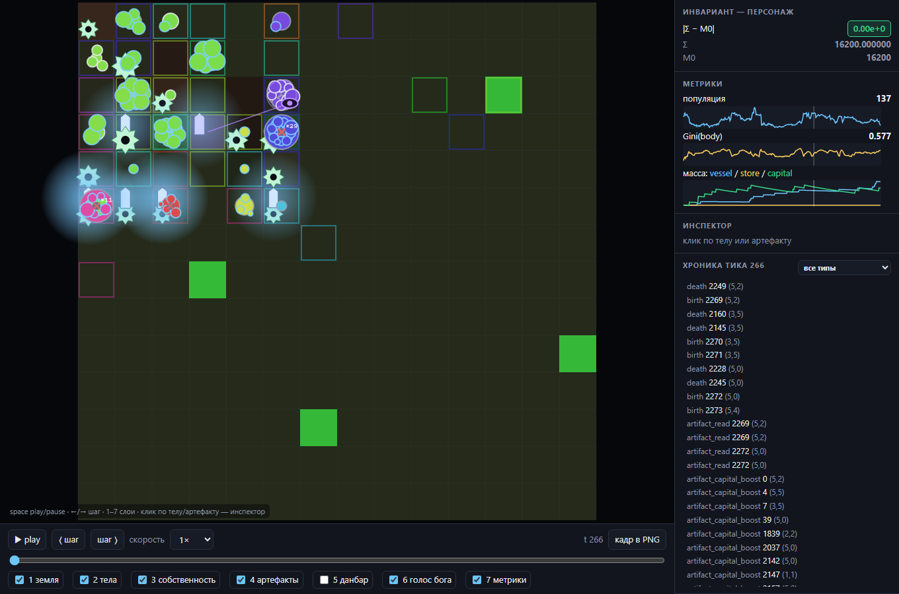
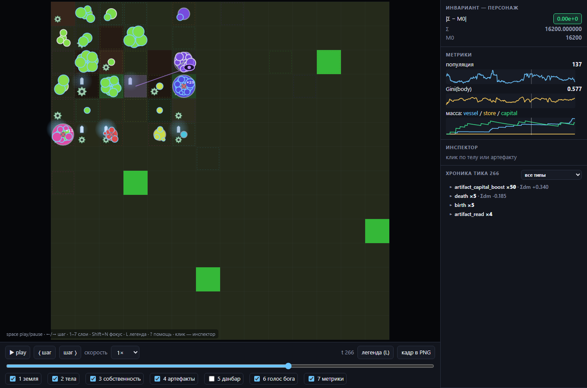

# «Стеклянный полис» — Glass Polis

Детерминированная визуализация всей колонны Stage-3 в один прогон: экономика
(апроприация), социальный локус Данбара, полный резервуар артефактов (vessel + store +
capital) и голос бога (Демерзель). **Один лог → один и тот же фильм.**

Два артефакта:

- `stage3/viz_export.py` — **экспортёр** (чистый python stdlib + numpy). Прогоняет полис
  в шоукейс-конфиге и читает *публичное* состояние мира и `EventLog` снаружи. Механику не
  трогает ни на байт (гейт **V-OFF**).
- `viz/glass/index.html` — **рендерер**. Один самодостаточный файл: vanilla JS + canvas,
  **ноль зависимостей, ноль CDN, ноль сборки**.

## Проход читаемости (до / после, тик 265, seed 7)

Легенда, приглушённые артефакты (тела — главные), пунктирные рамки владения, агрегация
хроники, ховер-тултип, онбординг и фокус слоя (`Shift+N`):

| до | после |
|----|-------|
|  |  |

Скриншоты регенерируются headless-браузером: `py -m http.server` в `viz/glass`, затем
`chrome --headless=new --screenshot=… "http://localhost:PORT/index.html?t=265"`.

---

## Запуск

### 1. Собрать данные
```powershell
py stage3\viz_export.py                 # -> viz\glass\data\ (≈8 МБ на 400 тиков box6)
py stage3\viz_export.py --seed 8 --days 200 --every 2 --out viz\glass\data
```
CLI: `--seed N` `--days N` `--every K` (снапшот каждые K тиков) `--arena {N|none}` `--out DIR`.
Пакет данных регенерируемый и **git-ignored**. Дефолтный пакет (box6, seed 7, 400 тиков)
имеет якорный SHA-256 `c3c45fa2ecc5363f…3a40` — он **не меняется**, index.html в пакет не
входит и в SHA не хэшируется (`package = данные`, три файла).

#### Фильм на всём поле (`--arena none`) — режим витрины
```powershell
py stage3\viz_export.py --arena none --out viz\glass\data
```
Дефолт (`--arena 6`, box6) — это clamp-загон mod-21/enclosure, прижатый к углу (0,0):
компактно, но обитаема лишь часть поля. `--arena none` освобождает всё поле 14×14 —
за 400 тиков обитаемы 100% клеток, pop ≈ 729 vs 137, все культурные механики живы
(vessel/store/capital/draw), drift ~1e-12. Пакет тяжелее (**≈44 МБ**; сбить `--every 2`/`4`).
> ⚠️ **Не смешивать режимы.** Научные якоря и findings витка 2 (HG-гипотезы) измерены и
> живут в **box6**. Вольная арена — только витрина; robustness-прогон гипотез на ней —
> отдельная будущая задача.

### 2. Открыть фильм — два пути (оба обязательны)
- **Локальный сервер** (`fetch` работает):
  ```powershell
  cd viz\glass ; py -m http.server 8000
  ```
  открыть <http://localhost:8000/> — данные подтянутся из `./data/` сами.
- **Двойной клик** по `index.html` (offline, `file://` блокирует `fetch`): перетащить в
  окно три файла — `meta.json`, `snapshots.jsonl`, `events.jsonl`.

URL-параметры: `?debug=1` — панель «крутилок» Э-2 (масштаб тела, γ свечения, размер
глифа); `?t=N` — перемотка на тик N с паузой (детерминированный кадр для скриншотов и
deep-link'ов).

### 3. Проверить гейты
```powershell
py stage3\run_glass_v.py                # V-OFF / V-replay / V-invariant / V-complete / V-schema + регрессия
py stage3\run_artifact_f2.py --all      # регрессия механики: якоря бит-в-бит
```

---

## Формат данных (контракт экспортёр ↔ рендерер)

`meta.json` — один объект: `schema`, `seed`, `days`, `arena_side`, `grid_rows/cols`, `cfg`
(полный конфиг + `REPRO`), `M0` (инвариант на t=0), `houses`, `snapshot_every`,
`field_every`, `event_types_rendered`, `event_types_ignored`.

`snapshots.jsonl` — по строке на снапшот (каждые `--every` тиков):
```
t · pawns[[oid,i,j,body,house,phase]] · arts[[aid,kind,i,j,mass,salience,maker]]
owners[[i,j,oid]] · known[[a,b,w]] · god{oid,i,j,goal,push[[i,j,cnt]]}
soil/plant[row-major]  (полный грид каждые 10 тиков; между ними опущены)
metrics{pop,gini_body,mass_vessel,mass_store,mass_capital,invariant}
```

`events.jsonl` — по строке на событие: `{t,type,actor,where,dm,data}` — **прямой прокси
`EventLog`, без переименований типов**.

- `house` = основатель-корень линии, восстановленный из событий `birth.parent` → корневой
  `seed` (чистое чтение лога, не хук в мир).
- Кванты: тела/масса 3–4 знака, soil/plant 2 знака, метрики и `invariant` — 6 знаков
  (хватает, чтобы `|Σ − M0| < 1e-9` пережило округление, т.к. дрейф ≪ 1e-6).
- Бюджет ≤ 15 МБ. Рычаги: `--every`, поля раз в 10 тиков, эвристика Э-3 по known-рёбрам.

---

## Слои (чекбоксы 1–7, hotkeys 1–7)

1. **Земля** — heatmap soil (тёмная гамма) + plant (зелёная), интерполяция между полными гридами.
2. **Тела** — круг: радиус ∝ √body, цвет = дом (Э-1), обводка = фаза (INFANT/MATURE/ELDER).
   Рождение — расцветание, смерть — угасание в серый + крестик.
3. **Собственность** — рамка клетки: пунктир 1px, единая низкая альфа, цвет = тёмный
   оттенок дома владельца (не спорит с заливкой тела) (Э-1-rev2).
4. **Артефакты** — глифы canvas-путями: vessel — стела ▮, store — амбар ⌂, capital —
   шестерня ⚙. **Размер ∝ mass, гало ∝ salience — раздельно.** Приглушены (−30% размер,
   альфа ≤0.8, тонкий контур) — тела рисуются поверх (Э-2-rev2). Погасшая стела с массой =
   «нечитаемая руина» (mass>0, salience≈0) читается с одного взгляда.
5. **Данбар** — тонкие рёбра (1px, alpha ∝ вес), только связи ≤2 клеток; при >300 рёбер в
   кадре слой прячется за плашкой «данбар скрыт … клавиша 5». OFF при pop>120 (Э-3-rev2).
6. **Голос бога** — Демерзель: глиф-око в углу клетки, аура цветом директивы
   (PROMOTE — золото, SOW_DISCORD — красный, IMPLANT — фиолет), волна шёпота, стрелки к
   клеткам-мишеням.
7. **Лента метрик** — спарклайны pop / Gini(body) / масса по kind + плашка инварианта
   `|Σ − M0|` (зелёная, пока < 1e-9). Инвариант — персонаж.

**Интеракции:** play/pause/шаг/скорость (0.5–16×), скраббер, клик по телу/артефакту —
инспектор (body/mass/salience-спарклайны, знакомства, что написал/прочитал; слово «руина»
при salience < read_threshold), **ховер-тултип** (наведение без клика), хроника тика с
**агрегацией** однотипных событий (`artifact_capital_boost ×14 · Σdm +0.92`, разворот по
клику) и фильтром по типам (клик → подсветка локуса), легенда (образцы глифов 1:1),
онбординг-оверлей при открытии, кнопка «кадр в PNG».

**Hotkeys:** `space` play/pause · `←`/`→` шаг · `1`–`7` вкл/выкл слой · `Shift`+`1..7`
**фокус** одного слоя (остальное тускнеет до 15%, повтор — вернуть) · `L` легенда ·
`?` помощь · `Esc` закрыть оверлей.

---

## Эвристики (Э-1…Э-7) — вкусовые решения, кандидаты на пересмотр

| # | Решение |
|---|---|
| Э-1 | Палитра домов: `hue = (house*137.508) % 360` (золотой угол), s/l фиксированы. |
| **Э-1-rev2** | Рамка владения — тот же hue дома, но **ниже по светлоте** (l≈34), пунктир, единая низкая альфа. **Причина:** рамка была так же громкой, как заливка тела внутри неё. |
| **Э-2-rev2** | Тела — главные: артефакты **−30% размера**, альфа ≤0.8, тонкий контур; гало salience по **более крутой γ (≈1.1)** и меньшему радиусу; тела рисуются **поверх** артефактов. **Причина:** шестерня кричала громче пешки. Крутилки в `?debug=1`. |
| **Э-3-rev2** | Данбар: 1px, alpha ∝ w, только рёбра **≤2 клеток**; при **>300** рёбер — авто-плашка вместо каши; слой OFF при pop>120. **Причина:** длинные слабые рёбра сливались в размытые облака. |
| Э-4 | Плотность: >5 событий одного типа на клетке → один глиф со счётчиком «×N»; `artifact_capital_boost` агрегируется ВСЕГДА в пульс-в-тик с суммарным dm. |
| Э-5 | Коллизии: пешки на клетке — спираль Фибоначчи по oid; артефакты по углам (vessel NW, store NE, capital SW), Демерзель SE. |
| Э-6 | Лерп позиции только при `|Δi|+|Δj|==1`, иначе телепорт; поля — линейная интерполяция по t. |
| Э-7 | Три canvas-слоя (земля / глифы / вспышки); земля перерисовывается только на смене тика; requestAnimationFrame. |

Детерминизм рендера: ни одного `Math.random()`, ни одной зависимости от wall-clock в
геометрии состояния (время — только темп воспроизведения и фаза анимационных вспышек).

---

## Гейты V-*

- **V-OFF** — fingerprint прогона с экспортом == чистого прогона (экспортёр — чистый читатель).
- **V-replay** — два экспорта с одними аргументами → байт-идентичный пакет (печатается SHA-256).
- **V-invariant** — в каждом снапшоте `|metrics.invariant − M0| < 1e-9`.
- **V-complete** — типы из `events.jsonl` == `rendered ∪ ignored`, пересечение пусто.
- **V-schema** — валидатор структуры (stdlib): типы, границы координат, `kind ∈ {vessel,store,capital}`, монотонность `t`.
- **регрессия** — якоря п.0.2 бит-в-бит: `48d9729d` (vessel), `aa43ddad`/`961290bb`
  (OFF≡канон), `41bb81b4` (MFv2), `ca28db69` (Данбар).

---

## Ограничения и идеи на потом

- Голос бога рендерится из публичного `_decision_log`/позиции Демерзеля, а не из событий
  лога (шёпоты не логируются как события) — поэтому слой 6 идёт из поля `god` в снапшоте.
- Событий «дань/克» в этом конфиге лог не эмитит — не выдумываем то, чего нет в мире.
- **На потом:** экспорт GIF/webm; сплит-скрин сравнения двух прогонов (напр. store OFF/ON);
  подсветка посмертных прочтений (HF1); «аквариум»-режим для Raspberry Pi (автоплей,
  зацикливание). Цель по fps — 60 на box6, «не хуже 20» на Pi 5.
